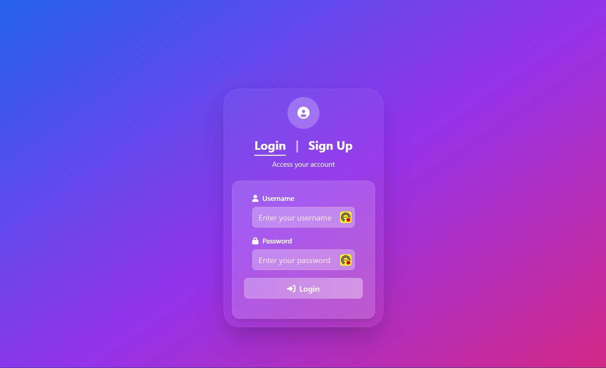
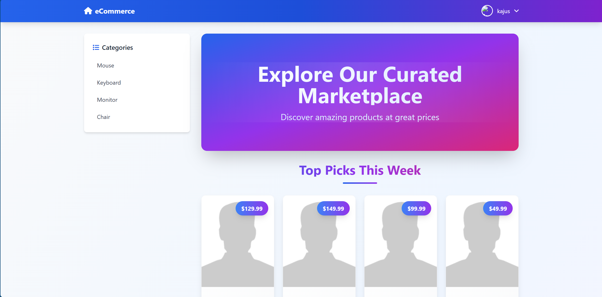
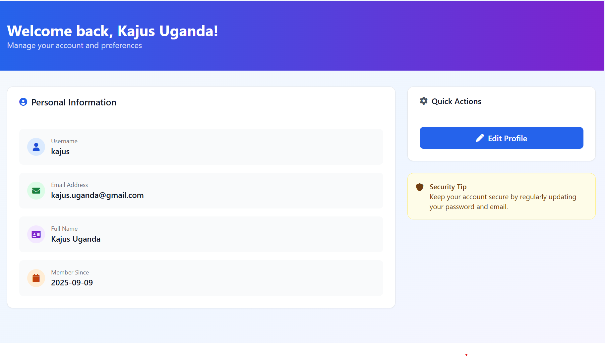
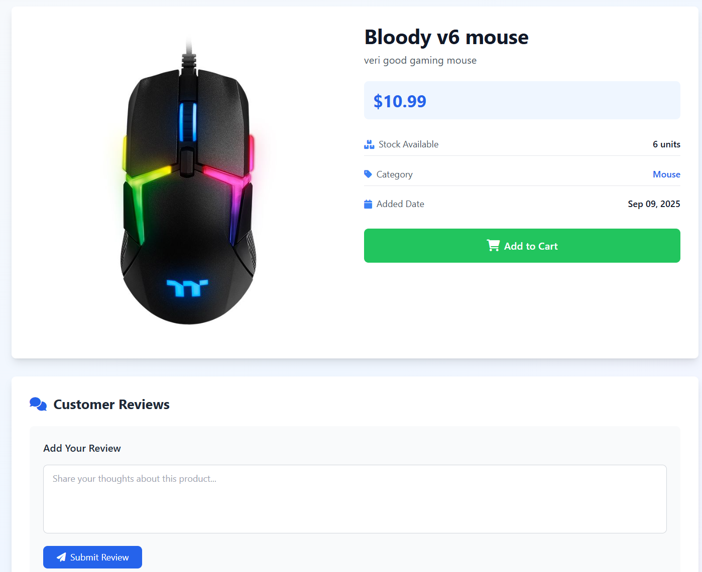
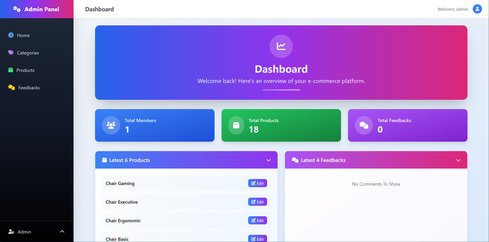

# 🛒 Simple E-Commerce Website

A simple e-commerce web application built with **PHP**, **MySQL**, **JavaScript**, and **TailwindCSS**.  
The project includes user authentication, product management, and an admin panel.
### 🔑Login Page


### 🏠 Home Page


### 👤Profile Page


### 🛍️ Product Page


### ⚙️ Admin Panel


---

## 📂 Project Structure
```
Ecommerce-WebSite/

│  
├──> admin / # Admin dashboard (categories, products, users management)  
│ ├──> categories.php  
│ ├──> products.php  
│ └──> ...  
│  
├──> includes/ # Shared PHP components (functions, database connection)  
│ ├──> db.php  
│ └──> functions.php  
│  
├──> uploads/ # Uploaded product images  
│  
├──> index.php # Homepage  
├──> products.php # Product list & details  
├──> login.php # User login  
├──> register.php # User registration  
├──> profile.php # User profile  
├──> logout.php # Logout  
│  
├──> init.php # Initialization (sessions, includes, etc.)  
├──> style.css # Custom CSS  
├──> script.js # Custom JavaScript  
│  
├──> .gitignore # Ignored files/folders  
└──> README.md # Project documentation
```
---

## 🚀 Features
- User registration & authentication  
- Product catalog with categories & search  
- Admin dashboard for managing products & categories  
- Modern responsive design with TailwindCSS  

---

## ⚙️ Installation

1. Clone the repository:
   ```bash
   git clone https://github.com/your-username/your-repo-name.git
   cd your-repo-name

---

## 👨‍💻 Author

-   [Kajus](https://github.com/kajus11)
